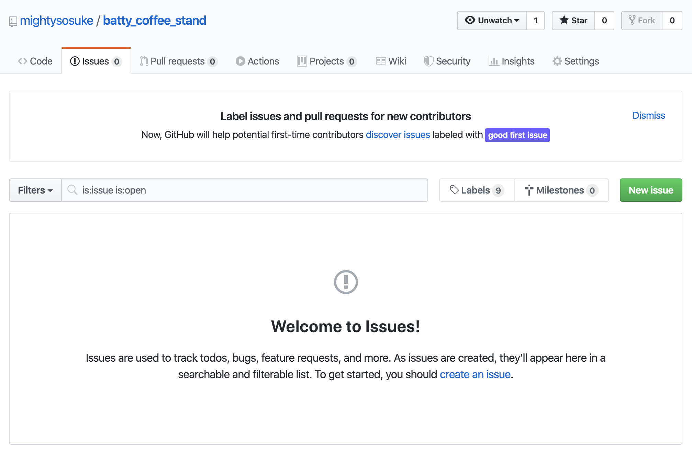
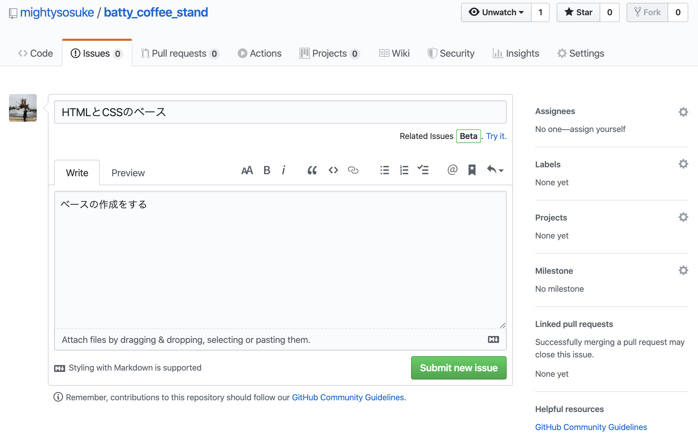
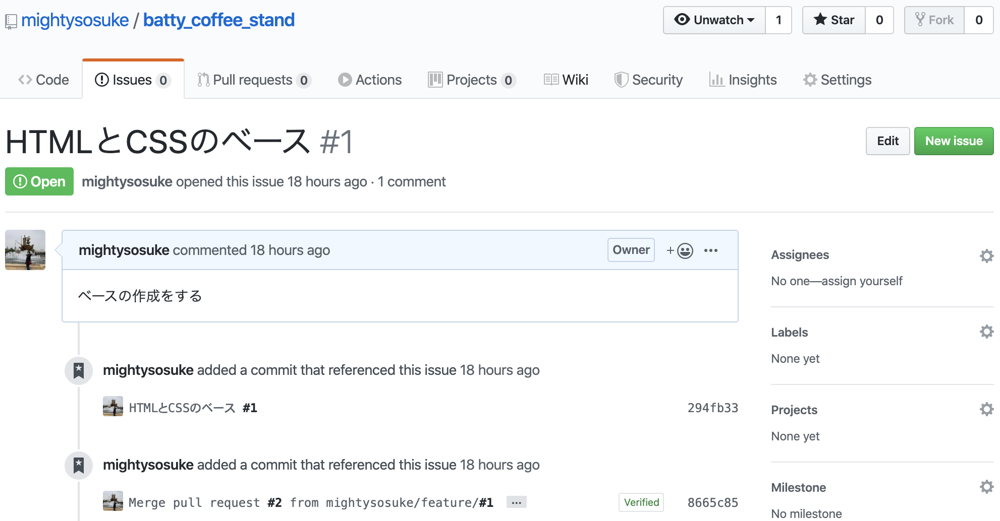
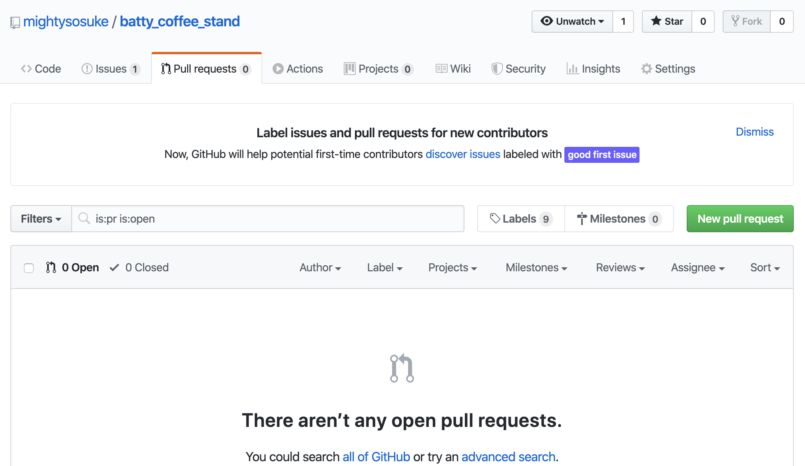
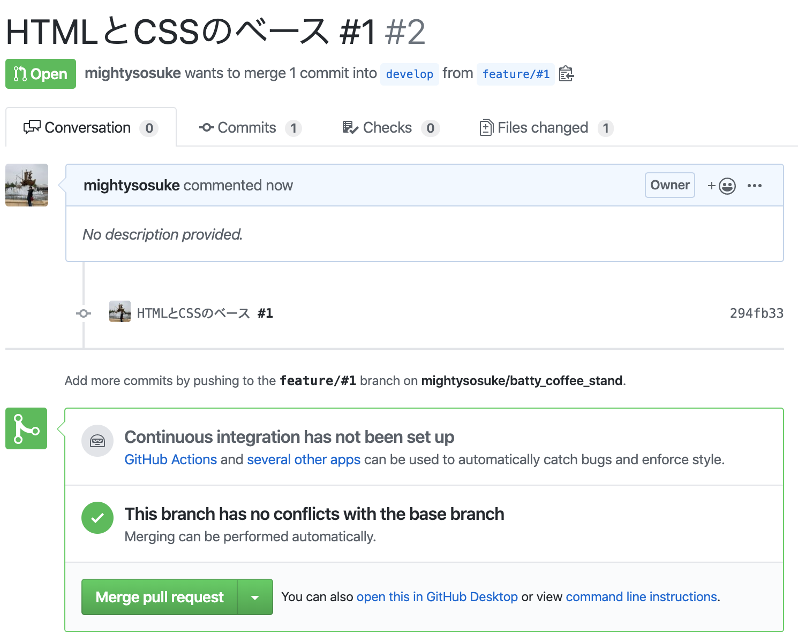
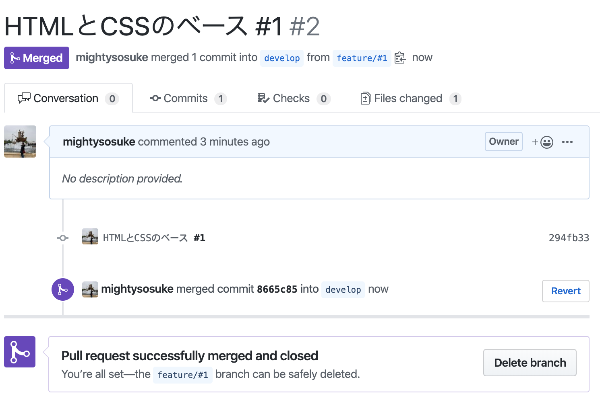
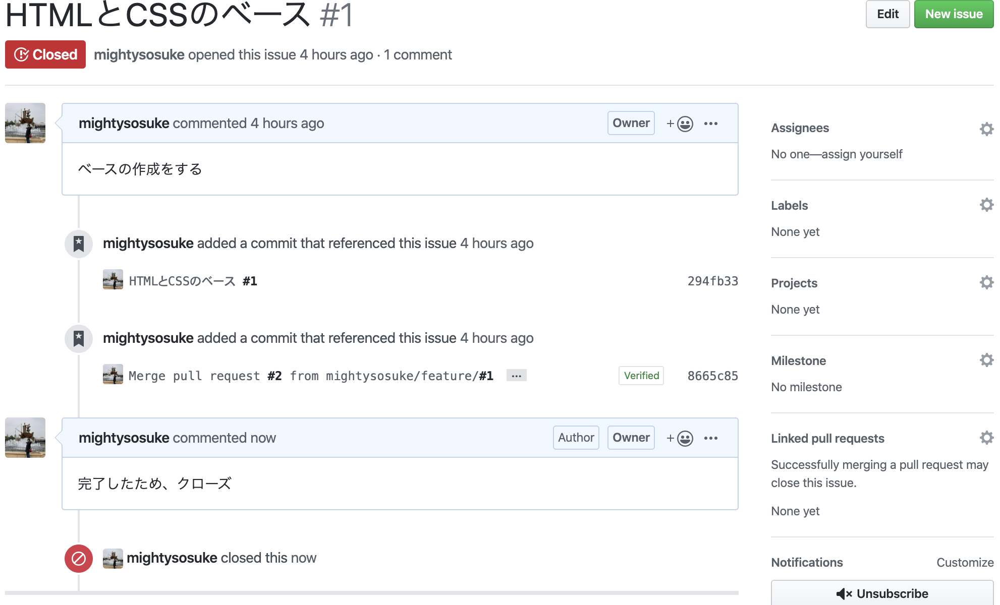
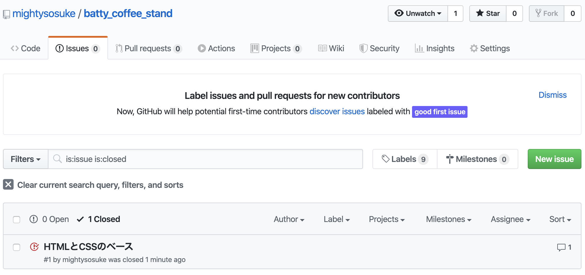

# Git Flow と Issue 管理の擬似体験

## 目的

1. Git Flow を使って開発効率を上げること
2. GitHub の Issue を使って、自分のタスクをうまく管理できるようにすること
3. ローカルの開発環境での開発を体験してみること

## 参考資料

https://qiita.com/fukubaka0825/items/c7710b4e87d478c8ba3b

## git flow について

Git には、開発しやすくするためのモデルがあります。<br>
そのうちの一つが `git flow` です。

[参考サイト](https://www.sejuku.net/blog/74224)

今回の擬似体験では、master、develop、feature の 3 つのブランチを使います。


**`master ブランチ`**

master ブランチには常に安定して動く、リリースした後のコードを置いておきます。<br>git flow ではこのブランチに直接コミットをすることはないので気をつけましょう。

**`develop ブランチ`**

develop ブランチでは次のバージョンをリリースするために、最新の開発履歴を残しておきます。<br>言わば git flow を使った開発の中心となるブランチで、常に最新の変更が加えられているブランチになります。

**`feature ブランチ`**

feature ブランチは、develop ブランチから分岐しているブランチです。<br>この feature ブランチでは新しく追加する機能の開発や、簡単なバグの修正を行うことが出来ます。<br>feature ブランチを変更する機能の数だけ切って、その中で個々の機能についての変更を行っていきます。<br>このブランチで作業し終わったあとはこのブランチは削除するのが一般的です。

## 環境構築

1. VSCode をインストールする

   https://code.visualstudio.com/

2. XCode をインストールする

   コマンド入力後、インストール確認のポップアップが出たらインストールをクリック

```zsh
$ xcode-select --install
```

3. Homebrew を導入する

   Homebrew のページから、コマンドをコピーして、ターミナルに入力<br>
   https://brew.sh/index_ja.html?_fsi=JrbahF8d

4. git-flow を導入する

```zsh
# git-flowの導入
$ brew install git-flow

# 動作確認
$ git flow

# これが出たらOK！
usage: git flow <subcommand>

Available subcommands are:
   init      Initialize a new git repo with support for the branching model.
   feature   Manage your feature branches.
   release   Manage your release branches.
   hotfix    Manage your hotfix branches.
   support   Manage your support branches.
   version   Shows version information.

Try 'git flow <subcommand> help' for details.
```

## プロジェクトの準備

1. 好きな場所に「 batty_coffee_stand 」ディレクトリを作成<br>
   私の場合、ホームディレクトリに`workspace`というディレクトリを作成し、そこでプロジェクトを管理しています。

2. techboost の受講中コースから、「Front05 HTML と CSS でサイトを作成していく」を開き、プロジェクトを準備する

```zsh
$ mkdir batty_coffee_stand
$ cd batty_coffee_stand
$ touch index.html
$ mkdir css

# 前のコマンドの引数のディレクトリに移動
$ cd $_
$ touch style.css

# 一つ上のディレクトリに移動
$ cd ..
$ mkdir image

```

## Git と GitHub の準備

1. リモートリポジトリの作成

   [GitHub](https://github.com/) 上に、batty_coffee_stand という名前で作成

2. 鍵の作成

```zsh
$ mkdir ~/.ssh
$ chmod 700 ~/.ssh
$ cd ~/.ssh

# githubのemailは自分のemailアドレス
$ ssh-keygen -t rsa -b 4096 -C "githubのemail"
```

すると、以下のように表示されるので、`Enterキーを3回`押してください。

```
Generating public/private rsa key pair.
Enter file in which to save the key (/Users/(username)/.ssh/id_rsa):
Enter passphrase (empty for no passphrase):
Enter same passphrase again:
```

本来は passphrase を入力すべきですが、今回は便宜上、未入力で進めます。

3. 鍵の登録

```zsh
$ cat id_rsa.pub
```

表示結果のうち「ssh-rsa」から最後の「自分のメールアドレス」までが公開鍵の「内容」です。<br>これをコピーして以下のリンクより GitHub に公開鍵を登録します。

https://github.com/settings/ssh

画面右上の「New SSH key」のボタンを押してください。<br>「Title」に任意の公開鍵名(local など)を、「Key」に先ほどコピーした公開鍵の内容をペーストします。

```zsh
$ ssh -T git@github.com
```

上記のコマンドを打った後、以下のメッセージが表示されたら、`yes`を入力し、Enter キーを押してください。

```zsh
The authenticity of host 'github.com (192.30.255.113)' can't be established.
RSA key fingerprint is SHA256:nTmki6kXUpJJUDNE1IGOCspRomTxdCHYSviKw6E5SY8.
Are you sure you want to continue connecting (yes/no)?
```

このように表示されたら接続は成功です。

```zsh
Hi （自分のアカウント名） You've successfully authenticated, but GitHub does not provide shell access.
```

4. ローカルリポジトリの作成

```zsh
# ホームディレクトリ に戻る
$ cd
$ cd batty_coffee_standのディレクトリ
```

```zsh
$ git init

# git@より後ろは、GitHubのSSHというところから引っ張ってきます。
$ git remote add git@github.com:アカウント名/batty_coffee_stand.git
$ git add .
$ git commit -m "first commit"
$ git push origin master
```

5. git flow の設定

```zsh
# git flowの設定をするコマンド
# developブランチが自動的に作成され、developブランチに移動
$ git flow init -d

$ git push origin develop

# リモートブランチを含むブランチの確認
$ git branch -a
```

## Issue 管理をしてみる

1. GitHub の「New issue」から issue を作成



2. Title と comment を以下の issue1〜issue4 の通りに埋めて、「Submit new issue」をクリック



**issue1**

```zsh
# Title
HTMLとCSSのベース

# comment
ベースの作成をする
```

**issue2**

```zsh
# Title
ヘッダーを実装する

# comment
タイトル部分の実装
ナビゲーション部分の実装
```

**issue3**

```zsh
# Title
コンテンツ部分を実装する

# comment
共通要素の取り出し
2カラムレイアウト
Informationの実装
Staffの実装
Accessの実装
```

**issue4**

```zsh
# Title
フッターを実装する

# comment
フッターを実装して完成
```

`ポイント`<br>
issue を作成すると、自動的に番号がつけられます。<br>
この画像でいうと、HTML と CSS のベースというタイトルの横に`#1`という番号がつけられています。



## ブランチを切る

先ほどの issue と同じ番号のブランチを切っていきます。<br>
このブランチでは、issue に書かれているタスクを完了させるための実装のみ実施していきます。

```zsh
# featureの'#1'という名前のブランチを切る
$ git flow feature start '#1'

# ブランチを表示する
$ git branch
```

## ソースコードを修正する

1. issue に合わせてソースコードを修正

&emsp;&emsp;各 issue は、「Front05 HTML と CSS でサイトを作成していく」と紐づいています。

2. VSCode でファイルオープン

## プルリクをしてマージする

1. 以下のコマンドを入力して、リモートリポジトリに push する

`ポイント`

コミットメッセージに必ず issue 番号をつけること<br>
そうすることで、commit が GitHub 上の issue と結びつきます。

```zsh
# ステージング状態にする
$ git add .

# コミットする(コミットコメントにIssueの番号をつける)
# コミットメッセージはIssueのTitleと同じにしておきます
$ git commit -m "HTMLとCSSのベース #1"

# リモートにプッシュする
$ git push origin 'feature/#1'
```

2. GitHub の「New pull request」から pull request を作成



3. base を develop、compare を feature/#1 に設定する<br>
   そして、Create pull request をクリック


4. Create pull request ボタンをクリックする<br>
   Reviewers や Assignees のことは、[こちらの記事のその他の設定項目](https://ics.media/entry/14449/)を参考にしてください。


5. コンフリクトが無いことを確認して、Merge pull request をクリック → Confirm merge をクリック



6. Pull request successfully merged and closed となったら、Delete branch をクリック



これで、リモートの feature ブランチは削除されました。

## ローカルリポジトリの feature ブランチを削除する

```zsh
# developへの移動
$ git checkout develop

# pullして、developを最新の状態にする
$ git pull origin develop

# feature/#1を削除する
$ git branch -d 'feature/#1'

# branchの状態を確認する
$ git branch
```

`feature/#1`ブランチが削除されていたら、ブランチの削除は成功です！

## issue をクローズする

1. issue 一覧から、削除したい issue をクリックする


2. 任意でコメントをつけて、Close and comment をクリック


3. ステータスが`Closed`に変わる



4. issue 一覧の、`Open` から `Closed` へと場所が変わる



## issue 番号についての解説

`プルリクをしてマージする`の項目内で、コミットコメントに`#1`をつけました。<br>
このように issue と同じ番号をコミットコメントをつけることで、issue とコミットを紐付けられます。

以下の画像の`HTMLとCSSのベース`はクリックすることができます。<br>
そして、ここをクリックするとコミットしたソースコードの差分を見ることができます。


## 残りの issue を片付ける

今までの一連の流れに沿ってソースコードを修正していきましょう。

#2〜#4 の issue も全てクローズさせてみてください。

## master <- develop のマージをする

今までに学んだことを活かして、develop ブランチのソースコードを master にマージしてみましょう。

develop ブランチは今後も使われるので、ブランチを削除しなくても構いません。
